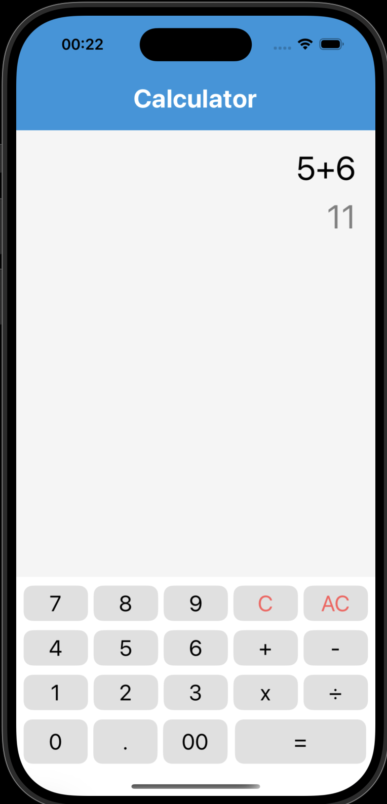
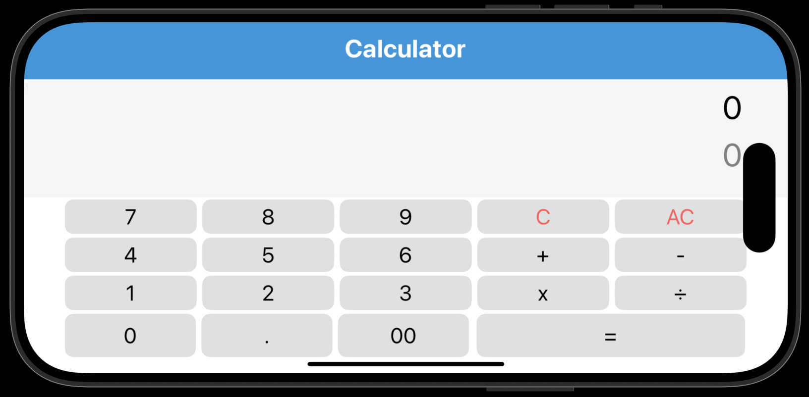

# Calculatrice React Native avec Expo 🧮

Une application de calculatrice simple et élégante créée avec [Expo](https://expo.dev) et React Native. Cette calculatrice offre une interface utilisateur intuitive inspirée du design iOS.

<div align="center" style="display: flex; flex-direction: row; align-items: center; justify-content: center;">
    
    
</div>

## Fonctionnalités

- Opérations arithmétiques basiques (+, -, ×, ÷)
- Interface utilisateur épurée et moderne
- Boutons C (effacer) et AC (tout effacer)
- Support des nombres décimaux
- Design responsive adapté aux différentes tailles d'écran

## Pour commencer

1. Clonez le repository et installez les dépendances
```bash
git clone [votre-repo]
cd calculator-app
npm install
```

2. Lancez l'application
```bash
npx expo start
```

L'application peut être exécutée sur :
- Un appareil physique via [Expo Go](https://expo.dev/go)
- Un [émulateur Android](https://docs.expo.dev/workflow/android-studio-emulator/)
- Un [simulateur iOS](https://docs.expo.dev/workflow/ios-simulator/)
- Un [build de développement](https://docs.expo.dev/develop/development-builds/introduction/)


## Technologies utilisées

- React Native
- Expo
- JavaScript/TypeScript
- File-based routing d'Expo


## En savoir plus

- [Documentation Expo](https://docs.expo.dev/)
- [Documentation React Native](https://reactnative.dev/)
- [Guide du file-based routing](https://docs.expo.dev/router/introduction/)

